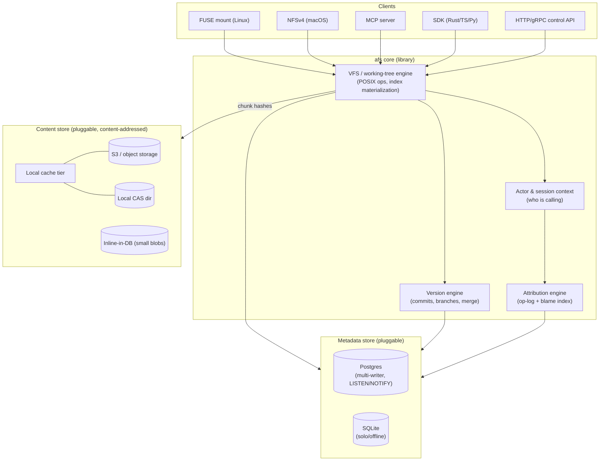

# afs — an agent-and-human filesystem with object storage, Postgres, Gitflow versioning, and edit attribution

> Design & implementation plan. This document specifies a custom, ground-up build inspired by
> [`tursodatabase/agentfs`](https://github.com/tursodatabase/agentfs), extended with the four capabilities
> we need: (1) object storage / remote content, (2) a pluggable metadata database (Postgres), (3) first-class
> Git-style versioning and merging, and (4) per-actor edit attribution in a shared human+agent workspace.

---

## 1. Vision — and what we change vs. agentfs

agentfs is a filesystem for AI agents that records every file edit and every tool call into **one SQLite/libSQL
file**, giving auditability, reproducibility (snapshot = copy the `.db`), and portability (one file). Its data
model is a POSIX inode/dentry table set (`fs_inode`, `fs_dentry`), file bytes stored as fixed **4 KB BLOB chunks
inside the DB** (`fs_data`, *not* content-addressed, no dedup), plus an **overlayfs-style copy-on-write** (a
read-only base + a writable delta with `fs_whiteout`/`fs_origin`), a `tool_calls` audit log, and a `kv_store`.

That design has four ceilings we hit:

| agentfs limit | Why it blocks us | What we build instead |
|---|---|---|
| Content is BLOBs locked in one SQLite file | Can't hold large files; can't share content across machines; the DB *is* the data | **Content-addressed object store** with pluggable backends incl. **S3 / remote FS**; DB holds only metadata + hashes |
| Storage engine hardwired to SQLite/libSQL | No real multi-writer; "remote" = copy the whole DB | **Pluggable metadata store**, **Postgres-first** for true concurrency; SQLite kept as a solo/offline mode |
| "Versioning" = overlay layers + `cp agent.db` | No named branches, no history DAG, no merge | **Opt-in Git-style commit DAG**, branches/refs, **three-way merge** — plus a **git-interop mode you can drive with the real `git` CLI / GitHub** |
| `tool_calls` records *tool calls*, not *who edited which bytes* | Can't tell agent-vs-human authorship inside a file | **Per-actor, per-range attribution** with blame + provenance, in a shared workspace |

The organizing insight: agentfs's copy-on-write overlay is *already* a branch. We make that literal by adopting
git's object model as the source of truth, and we split "the bytes" (immutable, content-addressed, in object
storage) from "the names and versions" (mutable metadata, in Postgres).

---

## 2. Architecture at a glance



Four layers, top to bottom:

1. **Access surfaces** — FUSE (Linux), NFSv4 (macOS), an MCP server, language SDKs, and an HTTP/gRPC control
   API for version operations. Every surface authenticates the caller into an **actor + session** that is
   threaded all the way down to attribution capture.
2. **Core engine** — a `VFS`/working-tree that answers POSIX ops against a materialized index; a `Version`
   engine for commits/branches/merges; an `Attribution` engine that records who wrote what.
3. **Metadata store** — a `MetadataStore` trait implemented for Postgres (primary) and SQLite (solo). Holds
   inodes, dentries, refs, commits, trees, the op-log, and the audit trail. **Never holds large file bytes.**
4. **Content store** — a `ContentStore` trait over content-addressed chunks. Backends: inline-in-DB (tiny
   blobs), local CAS directory, and S3/object storage, all fronted by a local cache tier.

---

## 3. The authoritative model (the key ruling)

**Decision: the git-style content-addressed Merkle object model is the source of truth for *committed* state;
POSIX inodes/dentries are a *mutable working-tree view* materialized on top of a base commit.** We do **not**
keep mutable inode tables as primary and snapshot them; that loses cheap history and dedup.

**Versioning is opt-in.** A workspace runs in one of three modes: `versioning = off` (just the mutable working
tree + attribution — a plain shared sandbox, no commits), `native` (afs's own content-addressed commit DAG), or
`git` (git-compatible objects you can drive with the actual `git` CLI). The rest of this section describes the
model that powers `native`/`git`; when versioning is `off`, only the working-tree half applies and the object
store is used purely as a chunk store. See §4c for the modes and the git-interop layer.

This resolves the POSIX-mutability-vs-immutability tension exactly the way git does — with an **index**:

- **Object store (immutable):** three object kinds, addressed by BLAKE3 hash.
  - `blob` = a **chunk manifest** (ordered list of content-chunk hashes + a size) — *not* raw bytes. Raw bytes
    live in the content store as chunks. (This is how we get large-file support and dedup for free.)
  - `tree` = a directory: entries of `(name, mode, kind, object_hash)`.
  - `commit` = `(root tree hash, parent hashes[], author actor, committer actor, message, timestamp)`.
- **Working tree + index (mutable):** per `(workspace, branch, session-or-shared)`, the metadata DB holds live
  `inode`/`dentry` rows — essentially agentfs's tables — but they are an **overlay whose base is a commit
  tree**. Reads fall through to the base tree (then to content chunks); writes copy-up into the working tree.
  This is precisely agentfs's overlay CoW, except the "read-only base" is now an immutable commit and the
  "delta" is the git index.

How mutable POSIX semantics coexist with immutable objects:

| POSIX operation | Working tree (mutable) | Object store (immutable) |
|---|---|---|
| `pwrite`, in-place edit | Mark inode dirty; buffer dirty page ranges; record op in op-log | nothing until commit/flush |
| `rename`, `link`, `unlink` | Mutate `dentry` rows (name→inode), adjust `nlink` | nothing |
| `fsync` | Flush dirty pages → re-chunk changed regions → write new/reused chunks to content store; update the inode's *current manifest* hash | new chunks + new `blob` manifest become durable |
| `commit` | Walk dirty inodes → finalize manifests → build new `tree` objects bottom-up → write `commit`; advance branch ref | new trees + commit |

So **durability of bytes** (fsync → content store) is decoupled from **durability of history** (commit → new
tree/commit). Between commits, the working tree is a normal mutable POSIX filesystem; at commit it crystallizes
into immutable objects. mmap, hardlinks, and special files are handled entirely in the working-tree layer;
only the *content* of a file is content-addressed.

---

## 4. The five subsystems in depth

### 4a. Content-addressed object store (object storage + large files)

**Content addressing.** Chunk key = **BLAKE3-256** of chunk bytes (fast, parallel, tree-hashable, no length
extension). Object key (blob/tree/commit) = BLAKE3 of the canonical-serialized object. Content addressing gives
us dedup, integrity verification (re-hash on read), and immutability — which is exactly what makes remote
object storage and cheap snapshots work.

**Chunking — content-defined, not fixed.** agentfs's fixed 4 KB chunks re-chunk the entire tail of a file on any
insertion. We use **FastCDC** content-defined chunking so an edit only rewrites the chunks it touches:

- target/avg chunk **~64 KB**, min **16 KB**, max **256 KB** (rolling Gear hash boundaries).
- files `≤` one min-chunk (say `≤ 16 KB`) are stored **inline** as a single chunk (optionally in-DB) to avoid
  per-tiny-file object-store round-trips.
- a file = an ordered **manifest** (`blob` object) of `(chunk_hash, offset, length)`. Large files never need to
  be fully resident: **range reads** map an offset to the covering chunks, **streaming reads** (`read_stream` /
  `read_to_writer`) pull one chunk at a time into a `Stream`/writer, and streaming writes append chunks — so
  there is **no fixed file-size ceiling**. Whole-file `read`/`write` still buffer in memory by choice (like
  `std::fs::read`); the VFS partial-write path bounds itself by what it can actually allocate (`try_reserve`),
  not an arbitrary limit, so a hostile size fails cleanly instead of aborting the process.

**Pluggable backends** behind one trait:

```rust
trait ContentStore {
    async fn put_chunk(&self, hash: Hash, bytes: Bytes) -> Result<()>;     // idempotent (content-addressed)
    async fn get_chunk(&self, hash: Hash) -> Result<Bytes>;                // verifies hash on read
    async fn get_range(&self, hash: Hash, off: u64, len: u64) -> Result<Bytes>;
    async fn has(&self, hashes: &[Hash]) -> Result<Vec<bool>>;            // batched existence
    async fn put_object(&self, hash: Hash, obj: &Object) -> Result<()>;    // blob/tree/commit
    async fn get_object(&self, hash: Hash) -> Result<Object>;
}
```

Backends: **`InlineStore`** (chunk bytes in a `content_inline` DB table, for tiny objects), **`LocalCasStore`**
(`objects/aa/bbbb…` sharded dir), **`S3Store`** (S3/R2/MinIO, plus GCS — either via S3-interop with HMAC keys or
natively via the GCS JSON API with OAuth2/service-account/ADC/workload-identity; chunk hash → object key; a **pack
layer** batches many small chunks into large objects rather than using S3 multipart; `GetObject` with `Range` for
`get_range`). "Remote filesystem" is just `S3Store`/`LocalCasStore`
pointed at a network target. A `TieredStore` composes a fast local **cache tier** (LRU on disk) in front of a
remote backend, with read-through, write-back batching, and **prefetch** of a manifest's chunks on open.

**GC.** Chunks and objects are immutable and shared across branches, so deletion is **mark-and-sweep with
refcounting from live refs**: roots = all branch/tag/HEAD refs + reflog + retained snapshots; walk commits→
trees→blobs→chunks to build the live set; sweep unreferenced content after a grace period. GC takes a ref-set
snapshot and never deletes anything reachable from a ref created during the sweep (see §7 race note).

**At rest.** Per-chunk optional **zstd** compression and opt-in **XChaCha20-Poly1305** encryption (default off; a
256-bit AEAD keyed by a raw 32-byte key or an **Argon2id**-derived passphrase key with a per-store salt — §7).
The 192-bit nonce is derived from the plaintext hash, so identical plaintext yields identical ciphertext and
dedup survives encryption (convergent encryption; optional per-workspace keying if cross-tenant dedup is
undesirable). The wrong key fails loudly — the AEAD tag won't verify — rather than returning garbage.

### 4b. Pluggable metadata database (Postgres-first, SQLite solo mode)

**Abstraction boundary.** A `MetadataStore` trait exposes *intent-level* operations, not raw SQL, so dialects
stay behind the boundary:

```rust
trait MetadataStore {
    async fn tx<R>(&self, f: impl FnOnce(&mut Tx) -> Result<R>) -> Result<R>;   // serializable/RC as needed
    // inodes/dentries
    async fn lookup(&self, parent: Ino, name: &str) -> Result<Option<Dentry>>;
    async fn create_inode(&self, meta: InodeInit) -> Result<Ino>;
    async fn set_manifest(&self, ino: Ino, blob: Hash, size: u64) -> Result<()>;
    // refs & objects
    async fn read_ref(&self, name: &str) -> Result<Option<Hash>>;
    async fn cas_ref(&self, name: &str, expect: Option<Hash>, next: Hash) -> Result<bool>; // compare-and-swap
    // attribution
    async fn append_ops(&self, ops: &[EditOp]) -> Result<()>;
    async fn blame(&self, blob_ver: BlobVer, range: ByteRange) -> Result<Vec<Attribution>>;
    // audit + change feed
    async fn record_toolcall(&self, tc: ToolCall) -> Result<()>;
    async fn notify(&self, channel: &str, payload: &str) -> Result<()>;
}
```

**Why Postgres unlocks the shared workspace:** MVCC + row-level locks give true concurrent multi-writer;
**advisory locks** (`pg_advisory_xact_lock(hash(inode))`) serialize hot-inode writes without blocking the rest;
**`LISTEN/NOTIFY`** is a native change feed for `watch`/FUSE cache-invalidation; **logical replication** and
read replicas scale reads and give geo-distribution. SQLite gives none of this (single writer), so it is our
**solo/offline** mode — and it preserves agentfs's "one portable file" property for local dev and disconnected
work; solo edits reconcile on reconnect via the same merge machinery (§4c).

**Dialect differences handled behind the trait** (not leaked to callers):

| Concern | Postgres | SQLite |
|---|---|---|
| auto id | `BIGINT GENERATED ALWAYS AS IDENTITY` | `INTEGER PRIMARY KEY AUTOINCREMENT` |
| now | `extract(epoch from now())` | `unixepoch()` |
| upsert | `INSERT … ON CONFLICT … DO UPDATE` | same syntax ✓ |
| JSON | `JSONB` | `TEXT` (JSON funcs) |
| inline bytes | `BYTEA` | `BLOB` |
| change feed | `LISTEN/NOTIFY` | polling / in-proc bus |
| CAS ref | `UPDATE … WHERE hash = expect RETURNING` | same, single-writer trivially |

Migrations are authored once as dialect-neutral steps with a thin per-engine emitter (`refinery`/`sqlx`
migrations with two SQL variants where they diverge). Connection pooling via `deadpool`/`sqlx` pool; PgBouncer
in front for large fleets.

### 4c. Versioning & Gitflow

**Versioning is opt-in (per workspace, three modes).** Not every workspace wants history; some just want the
shared sandbox + attribution. The `workspace.versioning` setting selects:

- `off` — no commits. The working tree (§3) is the whole story: a plain shared filesystem with attribution.
  Cheapest; good for ephemeral agent sandboxes.
- `native` — afs's own content-addressed commit DAG (below). Best for **large files + object storage**: sub-file
  chunk dedup, cheap snapshots, chunk-granular binary merges. The default when versioning is on.
- `git` — **interoperate with the real `git`** (see the interop block at the end of this section). History is
  expressible as genuine git objects so the actual `git` CLI, `git blame`, and hosts like GitHub work against
  the workspace; large files ride git-LFS pointers backed by our chunk store.

`native` and `git` share the same commit-DAG semantics and merge engine; they differ only in the on-disk object
encoding and how large files are represented, so a `native` workspace can turn on git-interop later without a
history rewrite.

**Object model** (in the content store, §4a): `blob`(manifest) / `tree` / `commit`, forming a Merkle DAG.
Because content is deduplicated chunks, a commit that changes one file re-uses every unchanged chunk and tree —
snapshots are O(change), not O(repo).

**Refs** live in the metadata DB (mutable pointers into the immutable DAG):

```
ref(name TEXT PK, kind ENUM['branch','tag','head'], target_hash, updated_at, updated_by_actor)
reflog(ref_name, old_hash, new_hash, actor_id, op, ts)   -- audit of ref moves
```

Branch/tag creation = insert a ref pointing at a commit. `HEAD` per session points at a branch. Branch updates
use **compare-and-swap** (`cas_ref`) so concurrent committers can't lose writes.

**Working states** mirror git: **working tree** (live inode/dentry overlay), **index/staged** (optional; agents
usually auto-stage), **committed** (a `commit` object). `status`/`diff` compare working tree ↔ base tree by
walking manifests and diffing chunk lists (and, for text, line diffs).

**Three-way merge** (`merge branch B into A`):

1. Find the **merge base** = lowest common ancestor commit in the DAG.
2. Diff base→A and base→B **per path** at tree level (adds/deletes/renames/type-changes reconciled first).
3. For each path changed on both sides, merge by **file class**:
   - **text** → 3-way **diff3** at line granularity against the base version; non-overlapping hunks auto-merge;
     overlapping hunks produce conflict markers and a `conflicts` row.
   - **structured (json/yaml/toml)** → optional semantic/AST merge; fall back to text.
   - **large/binary** → **never silent-merge.** Policy per workspace: (i) *conflict-both-kept* (keep both
     manifests, write `file.A`/`file.B`, mark conflict), or (ii) *lock-based* (git-LFS-style: a file can be
     **locked** for exclusive edit via a `locks` table, so binary changes serialize and never collide).
     Because files are chunk-manifests, when binary edits touch **disjoint chunk ranges** we *can* auto-merge at
     chunk granularity; only overlapping chunk ranges conflict.
4. Write a **merge commit** with both parents; unresolved conflicts block the commit until resolved (like git).

`rebase`/`squash`/`cherry-pick` replay commit diffs onto a new base; fast-forward when one side is an ancestor.

**Attribution survives merges** because the merge result's per-range authorship is computed from the two
parents' blame maps plus line-movement tracking (§4d): a merged line keeps the actor from whichever parent
introduced it; conflict resolutions are attributed to the resolving actor.

**Git interoperability (opt-in `git` mode).** So teams can keep their existing tooling, afs can present its
history as real git:

1. **Git-compatible object encoding.** In `git` mode, commits/trees/blobs are serialized in git's own object
   format (**SHA-256 git objects**, for a clean 256-bit hash story) and stored in the content store. A
   read-only, on-demand **`.git` view** lets the actual `git` binary run `log`/`blame`/`diff`/`checkout`
   against a workspace.
2. **`git-remote-afs` remote helper.** `git clone afs://host/workspace`, `git pull`, and `git push` work by
   translating git's pack protocol to afs commits/refs, so an ordinary external git repo (including on GitHub)
   stays bidirectionally in sync with an afs workspace.
3. **Large files via git-LFS.** Files above a threshold are represented to git as **git-LFS pointer files**; the
   LFS object is our content-addressed, chunked blob in object storage. Real git clients clone quickly and never
   inline multi-GB blobs, and we keep sub-file dedup + S3 backing. This is the honest reconciliation of
   "git blob = whole file" with our chunk model.
4. **Attribution vs. git blame.** git expresses only *commit-granular* authorship, so `git blame` shows the
   committing actor; afs's finer **range-granular, multi-actor-per-commit** blame (§4d) stays available through
   the afs API/xattr even in `git` mode. Where an afs commit mixes human and agent edits, the git view attributes
   the commit to the committer while afs retains the per-range truth.

Net: use `native` mode for maximum large-file / object-store efficiency; flip on `git` mode when you want the
real git ecosystem — and a workspace can do both.

### 4d. Attribution & provenance

**Actor model.** A single `actor` registry with a discriminator:

```
actor(id PK, kind ENUM['human','agent','system'], display_name,
      -- human:
      auth_subject,            -- OIDC/SSO subject, email
      -- agent:
      agent_model, agent_vendor, controller_actor_id,  -- the human who launched the agent (provenance chain)
      created_at)
session(id PK, actor_id FK, started_at, ended_at, client, mount_id, meta JSONB)
```

Every mount/API/MCP call authenticates into `(actor, session)`. Agents carry `controller_actor_id`, so we always
have the provenance chain *human → agent → edit*.

**Capture at write time.** Ground truth is an append-only **operation log**, tied to the audit trail:

```
edit_op(id PK, session_id, actor_id, tool_call_id NULL,   -- links to tool_calls audit
        ino, path, op ENUM['write','truncate','create','rename','delete'],
        byte_start, byte_len,          -- the range touched (byte granularity, natural for pwrite)
        pre_hash NULL, post_hash NULL, -- manifest before/after (for exact reconstruction)
        ts)
tool_calls(...)   -- agentfs's audit log, retained; edit_op.tool_call_id references it
```

Every `pwrite`/`truncate` records the actor + byte range. This is the durable, event-sourced truth of *who
touched what, when, in which tool call* — it survives even if we recompute everything else.

**Storage decision (the ruling): op-log as truth + a materialized interval blame index.** Not per-line author
columns (don't survive edits), not pure CRDT (too heavy for arbitrary binary pwrite and for agents that don't
use an editor). At commit, we finalize a compact per-blob-version **blame index**:

```
blame(blob_version PK-part, seq PK-part,   -- ordered, coalesced ranges covering the file
      byte_start, byte_end, actor_id, origin_op_id, origin_commit)
```

- Byte-range blame is exact for any file; for text we *derive* line-range blame on demand.
- Ranges are **coalesced** (adjacent same-actor ranges merged) so the index is small even for big files.
- On each new blob version, we diff parent→new, carry unchanged ranges' attribution forward, and attribute
  changed ranges to the op-log actor(s). This is the git-blame algorithm generalized to byte ranges.

**Blame query** (`blame(path@commit, range)`): load the blob-version's `blame` rows overlapping the range → join
`actor`/`session`/`edit_op`/`tool_calls` → return `(range, actor, human-or-agent, session, tool call, commit)`.

**Survival across merge/rebase/copy:** we run rename/copy detection (`-M/-C` like git) so blame follows moved
code; merge results inherit parent attributions per §4c; rebase replays carry the original author while
recording the rebasing actor as committer.

**Shared human+agent differentiation — the payoff:** because `actor.kind` distinguishes human/agent and each
range carries an `actor_id`, a single file edited by a person and an agent yields a blame map like
`bytes 0..1200 = human:alice, 1200..1800 = agent:claude(session 9, tool_call 42), 1800..2000 = human:alice`.
The FUSE/SDK exposes this via an xattr (`user.afs.blame`) and an API endpoint, and the MCP server can hand an
agent "show me only the human-authored regions" or "revert everything the agent wrote in this session."

### 4e. Access & live collaboration

**Surfaces.** `FUSE` (Linux, `fuser`), `NFSv4` (macOS, where FUSE is painful), an **MCP server** (agents call
`read`/`write`/`branch`/`commit`/`blame` as tools — and every call is auto-attributed and audited), language
**SDKs** (Rust core + TS/Python bindings), and an **HTTP/gRPC control API** for version ops (branch, merge, log,
blame). Each surface resolves the caller to `(actor, session)` and passes it down; the write path can't run
without an actor, which is what guarantees attribution coverage.

**Remote filesystem + consistency.** Clients on different machines share one workspace = one Postgres +
one object store. The client keeps a **local cache tier** (chunks + hot metadata). Consistency model =
**close-to-open** (like NFS): on `open` you see the latest committed/flushed state for that branch; your writes
are visible to others after `fsync`/flush; the control API offers stronger **leases** for exclusive sections.
Latency to object storage is hidden by prefetching a file's manifest chunks on open and write-back batching;
metadata round-trips are cut by caching dentries with `LISTEN/NOTIFY`-driven invalidation.

**Live shared workspace — the boundary (ruling):** two regimes, chosen per file:

- **Default (agents + ordinary tools):** the working tree of a `(workspace, branch)` is shared; concurrent
  writers coordinate via Postgres MVCC + **advisory locks per inode** for the brief critical section of a
  flush; non-overlapping writes never conflict (content-addressed), overlapping writes are last-writer-wins at
  the byte level with both recorded in the op-log, and *semantic* reconciliation happens at **commit-time
  three-way merge**. This covers agents that `pwrite` via FUSE/MCP and never open an "editor."
- **Opt-in live co-editing (human in an editor + agent via an editor-like API):** a file can be promoted to a
  **CRDT document** (Yjs/Automerge) for real-time character-level co-editing; the CRDT periodically checkpoints
  into the working tree (→ new manifest, op-log entries per actor's spans). This is where humans and agents
  literally type into the same buffer live; the CRDT's per-span authorship feeds the same blame index.

The boundary: **live co-editing is for open, editor-attached files; commit-time merge is for everything else.**
Both funnel into one attribution store, so blame is uniform regardless of path.

**Change notifications.** `watch(path|branch)` subscribes via Postgres `LISTEN/NOTIFY` (or the in-proc bus in
SQLite mode); FUSE uses these to invalidate its attr/dentry cache and to push inotify-style events.

**Offline.** SQLite solo mode (or a detached Postgres) accumulates commits locally; on reconnect we push
objects/chunks (content-addressed, so idempotent) and **merge** the divergent branch into the shared one with
the same three-way machinery — no special offline path.

---

## 5. Consolidated data model (portable DDL sketch)

Metadata store (Postgres shown; SQLite differs only per the §4b table). Content (chunks/objects) is **not** here
— it lives in the content store, referenced by hash.

```sql
-- identity ---------------------------------------------------------------
actor(id BIGINT PK, kind TEXT, display_name TEXT, auth_subject TEXT,
      agent_model TEXT, agent_vendor TEXT, controller_actor_id BIGINT, created_at BIGINT);
session(id BIGINT PK, actor_id BIGINT, started_at BIGINT, ended_at BIGINT,
        client TEXT, mount_id TEXT, meta JSONB);

-- working tree (mutable overlay over a base commit) ----------------------
workspace(id BIGINT PK, name TEXT, meta_backend TEXT, content_backend TEXT, created_at BIGINT);
inode(ino BIGINT PK, workspace_id BIGINT, branch TEXT, mode INT, nlink INT, uid INT, gid INT,
      size BIGINT, manifest_hash BYTEA NULL, atime BIGINT, mtime BIGINT, ctime BIGINT,
      rdev INT, dirty BOOL);
dentry(id BIGINT PK, workspace_id BIGINT, branch TEXT, parent_ino BIGINT, name TEXT, ino BIGINT,
       UNIQUE(workspace_id, branch, parent_ino, name));
symlink(ino BIGINT PK, target TEXT);
whiteout(workspace_id, branch, path TEXT, parent_path TEXT, created_at BIGINT,
         PRIMARY KEY(workspace_id, branch, path));  -- overlay deletes vs base commit

-- version control (refs mutable; commits/trees/blobs immutable in content store)
ref(workspace_id BIGINT, name TEXT, kind TEXT, target_hash BYTEA, updated_at BIGINT,
    updated_by BIGINT, PRIMARY KEY(workspace_id, name));
reflog(id BIGINT PK, workspace_id, ref_name TEXT, old_hash BYTEA, new_hash BYTEA,
       actor_id BIGINT, op TEXT, ts BIGINT);
lock(workspace_id, path TEXT, actor_id BIGINT, acquired_at BIGINT, expires_at BIGINT,
     PRIMARY KEY(workspace_id, path));   -- LFS-style binary locks
conflict(id BIGINT PK, workspace_id, merge_ref TEXT, path TEXT, state TEXT, detail JSONB);

-- attribution + audit ----------------------------------------------------
edit_op(id BIGINT PK, session_id BIGINT, actor_id BIGINT, tool_call_id BIGINT NULL,
        ino BIGINT, path TEXT, op TEXT, byte_start BIGINT, byte_len BIGINT,
        pre_hash BYTEA, post_hash BYTEA, ts BIGINT);
blame(blob_version BYTEA, seq INT, byte_start BIGINT, byte_end BIGINT, actor_id BIGINT,
      origin_op_id BIGINT, origin_commit BYTEA, PRIMARY KEY(blob_version, seq));
tool_calls(id BIGINT PK, session_id BIGINT, actor_id BIGINT, name TEXT, parameters JSONB,
           result JSONB, error TEXT, started_at BIGINT, completed_at BIGINT, duration_ms BIGINT);

-- optional inline content for tiny blobs
content_inline(hash BYTEA PK, bytes BYTEA);
kv_store(workspace_id, key TEXT, value JSONB, created_at BIGINT, updated_at BIGINT,
         PRIMARY KEY(workspace_id, key));
```

Immutable content-store objects (serialized, addressed by BLAKE3):

```
blob   = { size, chunks: [ {hash, offset, len} ] }         # manifest
tree   = { entries: [ {name, mode, kind, hash} ] }
commit = { tree, parents: [hash], author, committer, message, ts }
chunk  = raw bytes (in S3/local/inline)
```

### Consistency & concurrency contracts

- Ref moves are **CAS** (`ref.target_hash` guarded by expected value) → no lost branch updates.
- Hot-inode flush critical sections use **advisory locks**; everything else rides MVCC.
- Content writes are **idempotent** (content-addressed) → safe to retry, dedup across actors/branches.
- GC is refcount + grace-period mark-sweep with a ref snapshot (§7).

---

## 6. Key end-to-end data flows

**Write a file (`pwrite` via FUSE by agent `claude`, session 9, tool call 42):**
1. FUSE resolves caller → `(actor=agent:claude, session=9)`; op carries `tool_call_id=42`.
2. VFS locates/creates the `inode`; buffers the dirty byte range; marks `dirty`.
3. Append `edit_op(actor, session, tool_call_id, ino, 'write', start, len, ts)`.
4. On `fsync`: FastCDC re-chunks only affected regions → `put_chunk` new chunks (skip existing via `has`) →
   build new `blob` manifest → `set_manifest(ino, blob_hash, size)`. Bytes are now durable; history is not yet.

**Commit:** walk dirty inodes → finalize manifests → build `tree` objects bottom-up (reuse unchanged subtrees)
→ write `commit(root, parent=HEAD, author=actor)` → `cas_ref(branch, HEAD, commit)` → finalize `blame` for each
changed blob version from `edit_op`s → append `reflog`.

**Create branch:** `cas_ref(new_name, None, current_commit)`; the working tree for the new branch starts as an
overlay whose base is that commit (zero copy).

**Three-way merge with a conflict:** compute merge base (LCA) → per-path diff base→A, base→B → for a text file
changed on both sides, diff3 against base → non-overlapping hunks merge; one overlapping hunk writes conflict
markers + a `conflict` row → user/agent resolves → resolution attributed to the resolver in `edit_op`/`blame`
→ write two-parent merge commit.

**Blame a line** (`blame path@commit:line`): resolve path→blob version at commit → map line→byte range → select
`blame` rows overlapping the range → join `actor`/`session`/`edit_op`/`tool_calls` → return, per range,
human-or-agent + which session + which tool call + which commit introduced it.

**Human + agent co-edit the same file, live:** file promoted to a CRDT doc; Alice types in her editor, the agent
inserts via the editor API; the CRDT merges character ops with per-span authorship; every ~N ops it checkpoints
→ new manifest + `edit_op`s split by author span → blame index shows interleaved `human:alice` / `agent:claude`
ranges with zero manual bookkeeping.

---

## 7. Cross-cutting hazards (from the integration & security reviews) and how we handle them

- **Object-store latency vs POSIX (`fsync`, mmap, close-to-open):** never make FUSE block on S3 in the hot path.
  Writes hit the **local cache tier** first; write-back to S3 is async and batched; `fsync` guarantees *cache*
  durability, with a configurable "durable to remote" barrier for stronger needs. mmap dirty pages flush through
  the same re-chunk path on msync/close.
- **Attribution surviving merge/rebase:** handled by carrying parent blame maps + rename/copy detection (§4d);
  merges attribute conflict resolutions to the resolver, replays keep original authors.
- **Postgres contention on a hot FS:** the only global-ish serialization is per-inode flush (advisory lock) and
  per-branch ref CAS. Directory and content writes ride MVCC. Read replicas absorb read load; `LISTEN/NOTIFY`
  avoids polling. This scales to many writers as long as they touch different inodes — the common case.
- **GC racing live refs across branches:** GC snapshots the full ref-set (incl. reflog + retained snapshots)
  under a marker; any ref created mid-sweep pins its closure; only content unreferenced *before* the marker and
  past the grace period is swept. New chunks written during a sweep are pinned by an in-progress-write table.
- **Immutable objects vs mutable inodes:** resolved by the index/working-tree materialization (§3) — mutation
  lives in the working tree, immutability in the object store, commit is the bridge.
- **Metadata-DB loss (recovery):** the content store already holds a self-describing Merkle DAG
  (commit→tree→blob-manifest→chunks), so committed files, directories, and their names are reconstructable from
  the bucket alone — chunking is transparent because a file's manifest object lists its ordered chunks. The one
  thing the graph lacks is the mutable ref table, which otherwise lives only in the DB; we mirror it into the
  store as a `RefSnapshot` object on every ref change (kept as a GC root; superseded snapshots are reclaimed).
  `afs fsck [--rebuild]` (SDK `Workspace::rebuild`/`scan`) scans the store, recovers branch names + tips from the
  mirror — or by inferring heads if none exists — and materializes the working tree onto a fresh DB. Attribution
  (blame/audit/actors) and uncommitted edits are **not** recoverable: they live only in the DB, so it remains the
  component to back up (Postgres PITR/replica; SQLite continuous replication).

The remaining hazards came out of the **security review** — attribution is only trustworthy if the identity behind
each write is, and a storage engine that agents point at untrusted code and untrusted objects has to fail closed:

- **Client-named actors (attribution forgery):** identity is **resolved server-side and never taken from the
  request**. The HTTP/JSON body never carries an actor; `build_api_auth` binds the caller to an actor from the
  bearer credential and *refuses* to expose an unauthenticated API on a non-loopback address. Reads are open by
  default but gate behind the same credential when `ApiOptions::gate_reads` is set (via the `require_auth`
  layer; `/health` stays open). MCP and CLI resolve their own actor the same way — no surface trusts a name.
- **Poisoned path components:** a single name containing `.`, `..`, `/`, or NUL is rejected at *every* metadata
  boundary (`validate_component`), so a hostile name can never be **stored** — which is what stops it escaping
  later during host materialization (the sandbox's `export_tree`, a FUSE/NFS lookup). Every inode-oriented op
  validates names, not just the top-level path parser.
- **Adversarial encoded objects (decode-time DoS):** the object-graph and git-object decoders are bounded —
  length prefixes are capped and inflate is size-limited — so a malformed or maliciously huge object surfaces as
  an error instead of an unbounded allocation. Git OIDs and git-LFS pointers are validated before they are used
  as keys.
- **Torn multi-step mutations:** operations that touch several rows run inside a single `MetaTxn` that rolls back
  on drop, so a crash or mid-way error can't leave a half-applied state. Working-tree replacement
  (checkout/merge/recover) swaps the tree atomically (`truncate_tree` + `replace_working_tree`); `accept` lands a
  suggestion only if the author's base still matches (null-safe compare-and-set, `set_content_if`, so a stale
  proposal is rejected rather than silently clobbering a concurrent edit); ref-mirror generations advance with an
  atomic `bump_counter` instead of a read-modify-write.
- **Encryption key & nonce discipline:** convergent encryption keeps dedup (identical plaintext → identical
  ciphertext, which the shared content address already revealed — a documented, accepted trade-off), but the AEAD
  fails closed everywhere else: `put_keyed` refuses any non-content-addressed key, so a mutable-value keyed store
  can't be wrapped in encryption and made to reuse an (key, nonce) pair; and passphrase keys are derived with
  **Argon2id** (memory-hard) over a per-store random salt kept beside the content store — a weak passphrase is
  expensive to brute-force offline and the same passphrase never derives the same key across two stores.
- **Running untrusted agent code (sandbox boundary):** `afs sandbox` / `afs overlay` are **edit-capture, not a
  security boundary by default** — the child runs with your privileges over a copy-on-write view, so the host FS
  (incl. `meta.db`/`cas`) stays reachable; run only trusted code. Passing `--isolate` runs the command under
  **bubblewrap** in a fresh tmpfs root that hides the host filesystem (`meta.db`/`cas`, home, credentials) — a
  real *filesystem* boundary for untrusted code. Network egress is left shared on purpose (agents need it), so it
  is deliberately not a network boundary; the delta is captured and imported the same either way.

---

## 8. Recommended tech stack

- **Language: Rust** for the core (matches agentfs, best-in-class FUSE via `fuser`, zero-cost async, strong
  S3/Postgres crates, and it compiles to the native mount + the SDK). SDKs for **TypeScript/Python** via
  `napi-rs`/`pyo3` bindings over the same core. *Alternative:* Go (simpler concurrency, good FUSE via
  `bazil.org/fuse`) if team familiarity dominates — but we lose the single-core-shared-with-bindings advantage.
- **Metadata:** `sqlx` (compile-time-checked, supports Postgres + SQLite), `deadpool` pooling, `refinery`
  migrations. Postgres 15+.
- **Content:** the `object_store` crate (S3/R2/MinIO + GCS-interop via its `aws` feature; native GCS via its
  `gcp` feature), `blake3`, a FastCDC crate, `zstd`, `chacha20poly1305` (XChaCha20 AEAD) + `argon2`
  (passphrase KDF).
- **Access:** `fuser` (FUSE), an NFSv4 server crate or `nfs-rs` for macOS, `rmcp`/an MCP server crate, `axum` +
  `tonic` for HTTP/gRPC, `yrs` (Yjs in Rust) for opt-in CRDT co-editing.

---

## 9. Phased roadmap

| Milestone | Deliverable | Unlocks |
|---|---|---|
| **M0 — Skeleton** | `MetadataStore` + `ContentStore` traits; SQLite + `LocalCasStore` impls; inode/dentry working tree; basic `read`/`write`/`ls` via SDK | A working in-DB-metadata / on-disk-content FS; proves the metadata↔content split |
| **M1 — Content addressing + large files** | BLAKE3 + FastCDC chunking; blob manifests; dedup; range reads; **S3 backend** + tiered cache | **Object storage + large/remote files** (goal 1) |
| **M2 — Postgres backend** | `MetadataStore` for Postgres; dialect layer; migrations; pooling; `LISTEN/NOTIFY` | **Pluggable DB + multi-writer** foundation (goal 2) |
| **M3 — Versioning core (opt-in)** | commit/tree/blob objects; refs + reflog; `commit`/`log`/`checkout`/`diff`; overlay working tree over a base commit; per-workspace `versioning = off \| native \| git` switch | Real history + branches, opt-in (goal 3, part 1) |
| **M4 — Merge** | merge base (LCA); diff3 text merge; conflict model; binary lock/both-kept policy; rebase/squash | **Gitflow branch + three-way merge** (goal 3, part 2) |
| **M5 — Git interoperability (opt-in)** | git-compatible object mode (SHA-256 git objects); `git-remote-afs` remote helper; git-LFS pointer bridge to the chunk store; import/export a real `.git` | **Drive afs with the actual `git` CLI + GitHub** (goal 3, interop) |
| **M6 — Attribution** | actor/session registry; `edit_op` capture wired through the write path; `blame` index; blame API + xattr; merge/rebase blame survival | **Per-actor attribution + blame** (goal 4) |
| **M7 — Access surfaces** | FUSE mount; MCP server (auto-attributed tool calls); HTTP/gRPC control API; NFS for macOS | Agents + humans actually use it as a filesystem |
| **M8 — Live collaboration** | shared working tree with advisory-lock coordination; `watch`/NOTIFY; opt-in CRDT co-editing; offline solo + reconnect-merge | **Shared human+agent live workspace** (goal 4, live) |
| **M9 — Hardening** | GC (mark-sweep + grace); encryption/compression; metrics/tracing; benchmarks; **security review** — server-side identity + API auth, name/OID validation & bounded decoders, transactional atomicity, Argon2id at-rest keys, opt-in bubblewrap sandbox isolation (§7) | Production readiness |

Each milestone is independently demoable; M1+M2+M3 in either order after M0.

## 10. Risks & open questions

- **NFS on macOS** for POSIX fidelity vs. FSKit — decide per macOS version support target.
- **Semantic/structured merge** scope (which file types get AST merge) — start text-only, add JSON later.
- **CRDT ↔ commit reconciliation** — exact checkpoint cadence and how CRDT history maps into the op-log.
- **Multi-tenant dedup vs. privacy** — convergent encryption default (per-workspace keys = no cross-tenant
  dedup) vs. global dedup.
- **Blame at massive scale** — coalescing keeps it small, but confirm with a benchmark on multi-GB files.
- **Consistency knob** — is close-to-open enough for all agent workflows, or do some need linearizable reads?
- **git-mode fidelity** — SHA-256 git objects + LFS pointers vs. what GitHub/hosts currently accept; confirm host
  support and the remote-helper/LFS bridge performance on very large histories, and whether a workspace should be
  able to switch `native`↔`git` in place or only export/import.

## 11. Mapping: agentfs → afs

| agentfs | afs |
|---|---|
| `fs_inode` / `fs_dentry` | `inode` / `dentry` — but a **mutable working-tree overlay over a base commit** |
| `fs_data` (4 KB BLOB chunks in DB) | **content store**: FastCDC chunks, BLAKE3-addressed, in S3/local/inline; DB holds only `manifest_hash` |
| `fs_whiteout` / `fs_origin` (overlay CoW) | same overlay idea, but base = an **immutable commit tree** |
| snapshot = `cp agent.db` | **opt-in versioning**: `off` / `native` (chunked commit DAG) / `git`; branches = `ref` |
| git not involved | **opt-in `git` mode**: SHA-256 git-compatible objects, `git-remote-afs`, git-LFS bridge — usable with the real `git` CLI / GitHub |
| `agentfs sync` (libSQL whole-DB) | content is content-addressed & remote by default; metadata via Postgres/replicas; branches merge |
| `tool_calls` (audit) | retained `tool_calls` **+** `edit_op` op-log **+** `blame` index tying edits to **actors** |
| SQLite/libSQL only | `MetadataStore` trait: **Postgres** (multi-writer) or SQLite (solo/offline) |
| FUSE/NFS/MCP | same surfaces, each resolving an **actor+session** for attribution |
| single-user | **shared human+agent workspace** with per-range human-vs-agent differentiation |
